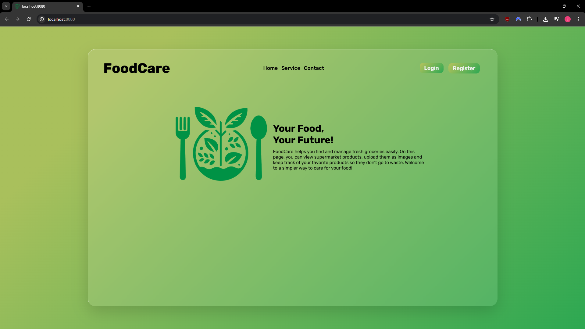
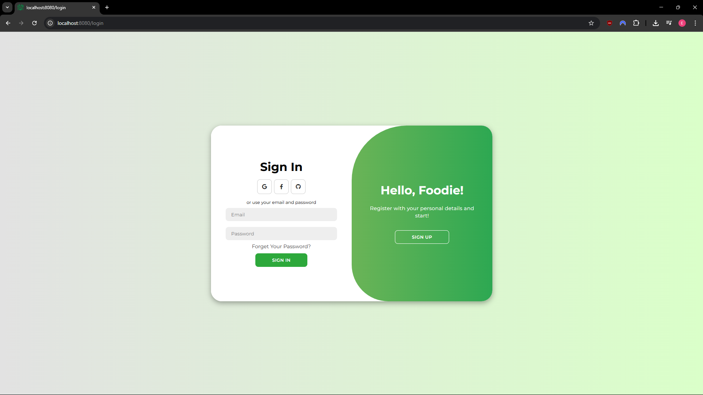
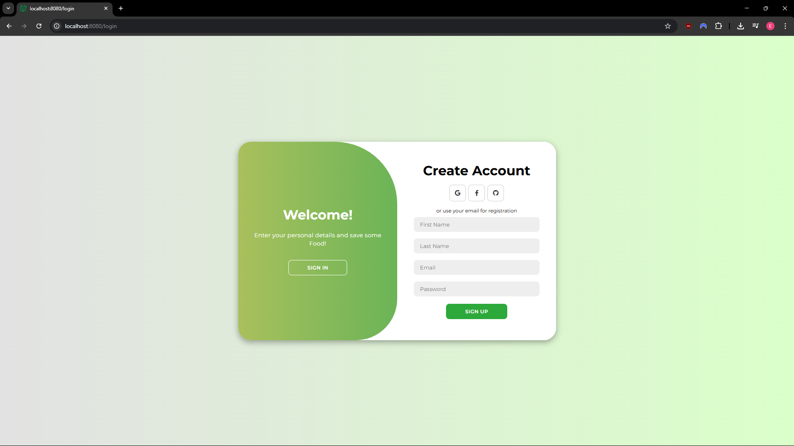
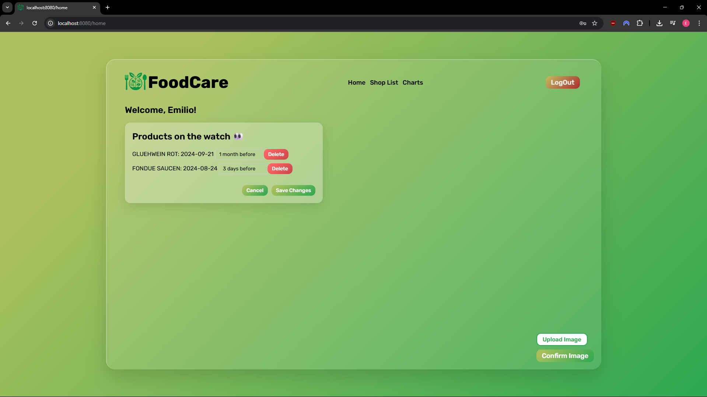
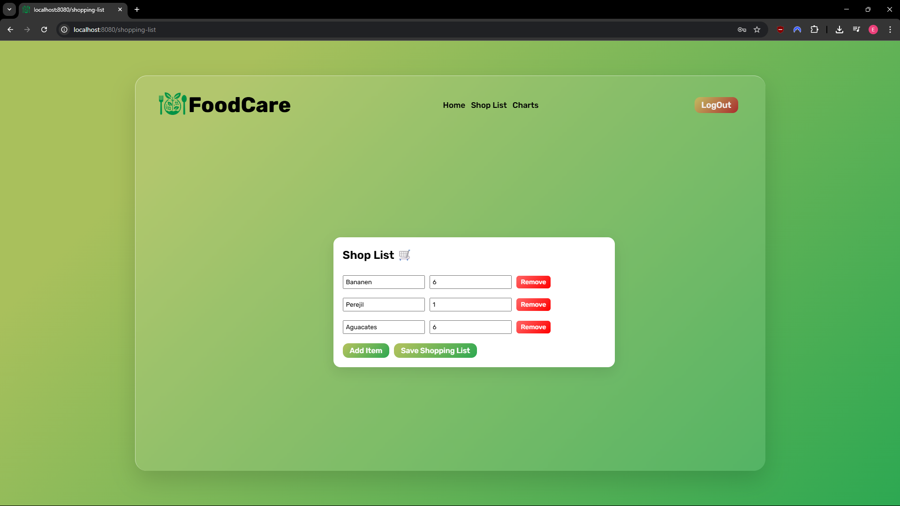
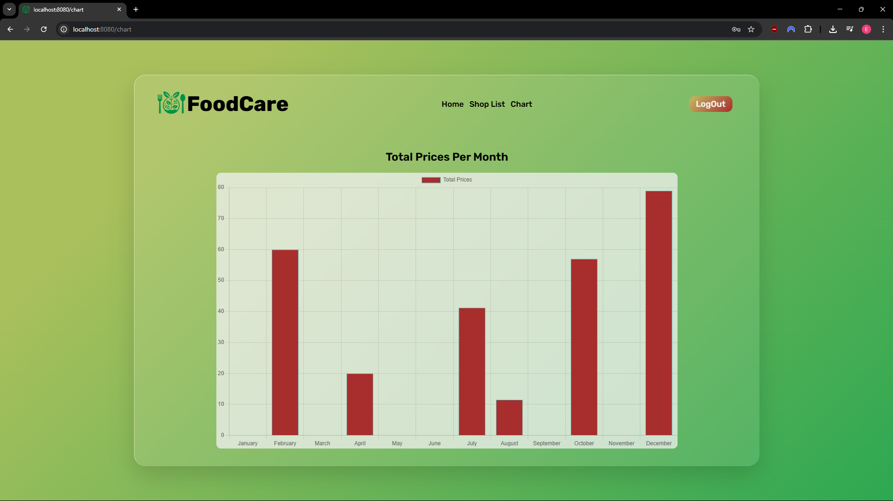

# 🥦 FoodCare – Smart Food Management

**FoodCare** is a web application developed as part of the *Web Technologies 2* course at Hochschule Bochum. The project aims to help reduce **household food waste** through intelligent grocery tracking and expiration reminders.

## 🌍 About the Project

FoodCare allows users to create an account, upload a photo of a **supermarket receipt**, and automatically extract purchased items using the **OpenAI ChatGPT API**. Users can then assign expiration dates to each item, and receive timely email alerts before their food goes bad.

### 💡 Key Features

- 📸 **Receipt Scanning with AI**: Upload a receipt photo and extract all items using ChatGPT.
- ⏰ **Expiration Alerts**: Receive email notifications 1 month, 1 week, or 3 days before an item expires.
- 🛒 **Shopping List**: Create and update a personal shopping list.
- 📊 **Spending Tracker**: Visualize monthly spending using interactive graphs (via Chart.js).
- 🔐 **Secure API Key**: The OpenAI API key is **not public** and must be provided securely via environment variables.

---

## 🛠️ Technologies Used

- **Frontend**: HTML, CSS, JavaScript
- **Backend**: Node.js, Express.js
- **Database**: MongoDB (via Mongoose)
- **AI Integration**: OpenAI ChatGPT API
- **Email Service**: Nodemailer
- **Charting**: Chart.js
- **Other Libraries**: Multer, Axios, dotenv, simple-encryptor, ics, fs

---

## ⚙️ Installation & Setup

### 📦 Requirements

- Node.js and npm installed
- MongoDB installed and running locally or remotely
- An OpenAI API key (added to a `.env` file)

### 🔧 Steps

1. **Clone the repository:**

```bash
git clone https://github.com/segacha/FoodCare.git
cd FoodCare
```
2.  **Install dependencies:**
```bash
npm install
npm install mongoose express multer cors axios simple-encryptor nodemailer ics openai fs dotenv chart.js --save
```

3. **Set up environment variables:**
```bash
OPENAI_API_KEY=your_openai_api_key_here
EMAIL_USER=your_email@example.com
EMAIL_PASS=your_email_password
```
4. **Start the database server:**
```bash
cd backend
node serve.js
```
5. **Start the localhost:**
```bash
npm run serve
```

## 🖼️ Screenshots

### 🏠 Welcome


### 🧾 Login


### 🧾 Create


### 🧺 Extracted Products


### 🛒 Shopping List


### 📊 Monthly Spending Tracker


